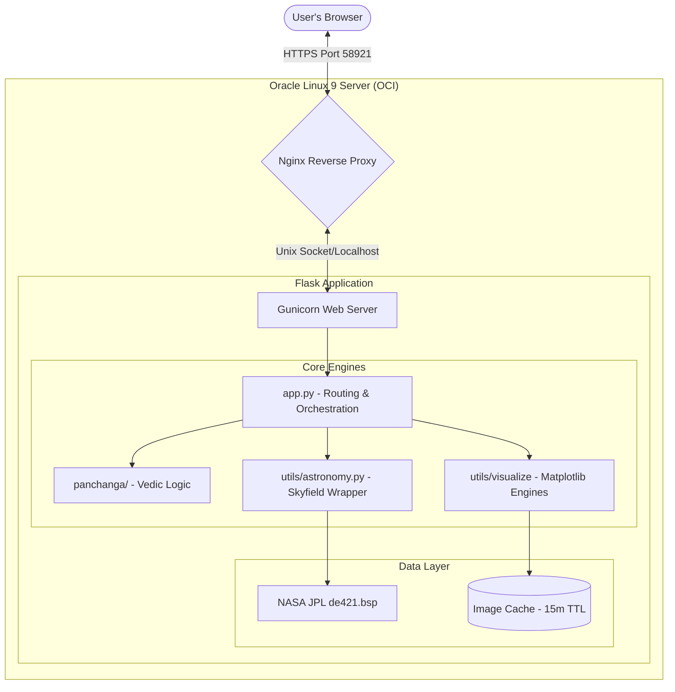
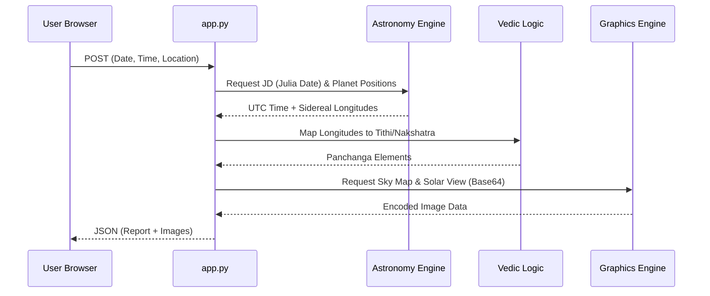

# Hindu Panchanga Converter v4.1 - Design Guide

## 1. Introduction
The **Hindu Panchanga Converter** is a high-precision astronomical and Vedic calendar engine. Its primary objective is to bridge the gap between ancient Vedic science and modern celestial mechanics. Version 4.1 makes the engine **Generic**—allowing it to convert any Gregorian event (Birth, Festival, Muhurta) into its full Vedic equivalent with supporting cosmic visualizations.

---

## 2. Universal Strategy (v4.1 Updates)
1. **Hybrid Naming**: Nakshatras, Rashis, Lagnas, and Planets now display the Vedic name followed by the Western equivalent (e.g., *Mesha (Aries)* or *Budha (Mercury)*).
2. **Dynamic Canvas Scaling**: The "Cosmic Alignment" canvas is increased by 23% to accommodate high-detail hybrid naming.
3. **Optimized Visuals**: Sky-map titles are repositioned to prevent clipping, and terminologies are shifted from "Birth" to "Cosmic" to fit any event type.
4. **Next 20 Occurrences**: The iCal engine now finds exactly the next 20 occurrences of a Vedic date (Anniversaries), ideal for recurring annual festivals or birthdays.

---

## 3. High-Level Architecture
The application follows a modular **Client-Server Architecture**. It is designed to be lightweight, stateless on the client side, and highly accurate on the backend.

### System Architecture Diagram

---

## 3. Major Components

### A. Presentation Layer (Frontend)
- **Tech Stack**: HTML5, Vanilla CSS3 (Glassmorphism), Vanilla JavaScript.
- **Key Features**:
    - **Geolocation**: Uses browser APIs and Nominatim reverse geocoding to resolve UTC offsets and coordinates.
    - **Asynchronous Loading**: Panchanga data loads first; high-resolution images load in parallel via a separate API path to ensure high responsiveness.
    - **Base64 Rendering**: For privacy, images are rendered from data streams rather than public URLs.

### B. API Layer (Flask)
- acts as the **Orchestrator**.
- **Endpoints**:
    - `/api/panchanga`: Returns the core 5-limb status (Tithi, Vara, Nakshatra, Yoga, Karana), Rashi, and Lagna.
    - `/api/skyshot`: Generates a 2D ecliptic wheel of the Moon and Stars (Nakshatras).
    - `/api/solar-system`: Generates a 3D-projected heliocentric view of the solar system.
    - `/api/generate-ical`: Calculates 20-year recurrences and packages them into a `.ics` file.

### C. Astronomical Engine (`utils/astronomy.py`)
- **Engine**: Skyfield (Python).
- **Ephemeris**: Uses NASA JPL DE421 developmental ephemeris (standard for 1900-2050).
- **Ayanamsha**: Implements high-precision **Chitra Paksha (Lahiri)** ayanamsha using polynomial series for sub-arcsecond accuracy.

### D. Visualization Engine
- **Modules**: `utils/skyshot.py` and `utils/solar_system.py`.
- **Backend**: Matplotlib with `Agg` (non-interactive) backend.
- **Thread Safety**: Uses **Object-Oriented Matplotlib** (Figure object) to prevent shared state issues when multiple users generate images concurrently.

---

## 4. Implementation Logic

### Data Flow Diagram (Panchanga Request)

### Privacy "Stealth Mode" Implementation
To protect sensitive birth data:
1. **Filename Hashing**: User inputs are hashed (MD5) so the server never stores filenames that describe a specific person.
2. **Base64 Tunnelling**: Images are read from disk, converted to Base64, and sent in the JSON stream.
3. **Internal-Only Folders**: Nginx is configured to block direct public access to `/static/skyshots/`.
4. **15-Min Expire**: A cron job deletes the physical images 15 minutes after creation.

---

## 5. Deployment Stack (Oracle Linux 9)
The app is hardened for secure enterprise-grade deployment:
- **Nginx**: SSL termination on Port 58921.
- **SELinux**: Explicit `httpd_sys_content_t` contexts for assets and `bin_t` for Gunicorn.
- **Fapolicyd**: Handled/Disabled to allow custom Python binary execution.
- **Logrotate**: Hourly rotation of PII-sensitive logs.

---

## 6. Developer Guidelines
- **Modifying Calculations**: Edit `panchanga/calculations.py`. All astronomical calls must pass through `utils/astronomy.py`.
- **Changing Styles**: Centralized in `static/css/style.css` using CSS Variables (`--primary`, `--accent`).
- **Memory Management**: Ephemeris data (`eph`) is global and shared between modules to minimize RAM usage on 1GB instances.
