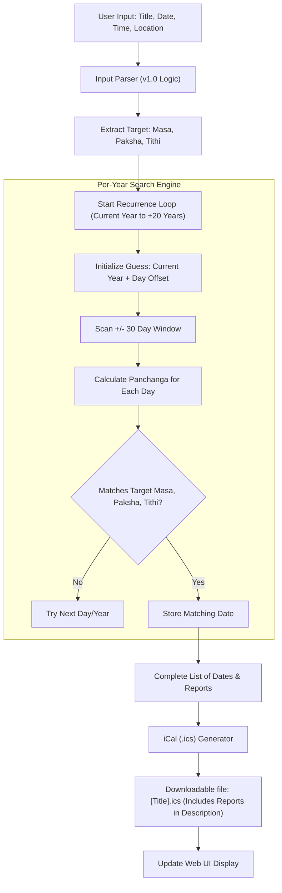

# Architecture: v2.0 Recurrence Workflow

## Workflow Diagram

## Component Additions

### 1. Recurrence Engine (`panchanga/recurrence.py`)
*   **Function:** `find_recurrences(base_dt, loc_details, num_years=20)`
*   **Logic:** Starts the search loop from the **current year** (determined by `datetime.now().year`), ensuring that even for historical input dates, the calendar events generated are relevant for current and future use.

### 2. iCal Formatter (`utils/ical_gen.py`)
*   **Function:** `generate_ics(title, events_data)`
*   **Feature:** Populates the `DESCRIPTION` field with the full ASCII report generated for each occurrence.
*   **Standard:** RFC 5545 compliance.

## Technical Note: The 30-Day Search Window

Finding a Hindu date in a future Gregorian year requires a search window because the two calendars are not synchronized:
1. **Lunar-Solar Drift:** A lunar year is approximately 354 days (11 days shorter than a solar year). This causes the Hindu date to move ~11 days earlier in the Gregorian calendar each year.
2. **Adhika Masa (Intercalary Month):** To keep the lunar calendar aligned with the seasons, an extra month is added roughly every 3 years. This can push a date ~18-19 days *later* than its previous year's occurrence.
3. **The Window:** A search window of +/- 30 days around the current year's date ensures we capture the next occurrence regardless of whether it drifted earlier or jumped later due to an Adhika Masa.

### 3. API Enhancement (`app.py`)
*   **New Endpoint:** `/api/generate-ical`
*   **Params:** Same as v1.0 + `title`.
